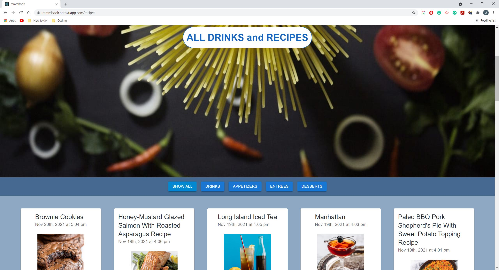
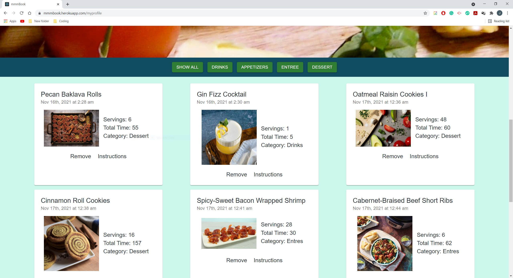
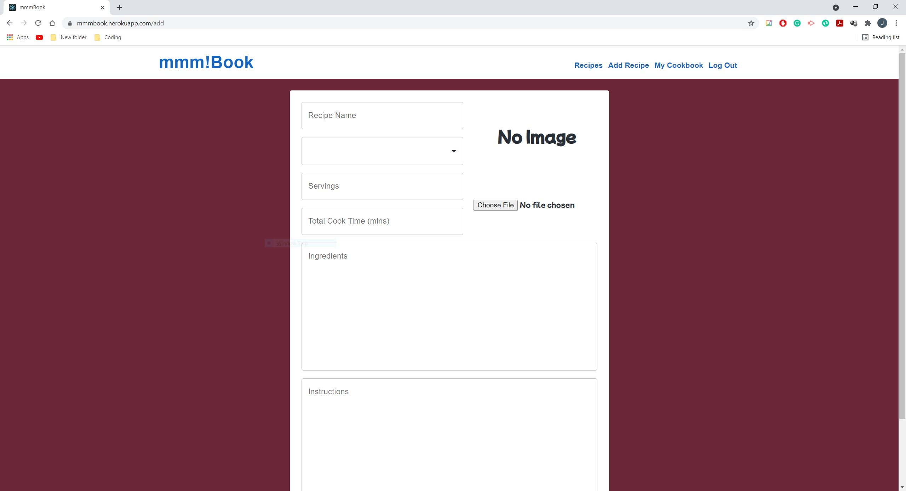

## Project Title: mmm!Book

  ## Description:
  A virtual recipe finder and personal cookbook. The application allow users to add all kinds of recipes. These recipes range from different types of dishes like entrees, appetizers, and even drinks. User can look for recipes created by other chefs and users and save them in a personal cookbook. In addition, aspring chefs and cooks can create and upload different recipes as a way to store recipes and allow other users to see and save those recipes for easier access. 

  ## Table of Contents
  * [Installation](#installation)
  * [Usage](#usage)
  * [Contributors](#contributors)
  * [License](#license)
  * [Tests](#tests)
  * [Questions](#questions)
  
  ## Installation
  -- What technologies did the application require in order to run smoothly and effectively?--

  A couple of technologies used in this application on both the Front End and the Back End

  Front-End:
  * HTML
  * CSS
  * Bootstrap (mostly framework)
  * Material UI 
  * Cloudinary (for images)
  * React
  * Bcrypt (password encryption)
  * Heroku (Hosting)

  Back-End:
  * JavaScript
  * Apollo
  * MongoDB (database)
  * Mongoose
  * NoSql
  * Node.js (server)
  * Express (server

  ## Usage
  -- What is the application used for? --

  The application can be used by anyone who enjoys cooking or trying different foods. Aspiring chefs can also use the application to store and share different recipes.

  ## License
  -- Are there any license the application has? --

  This Application is covered by the MIT license.

  [License Information](https://opensource.org/licenses/MIT)

  

  ## Contributors
  -- Were there any contributors to the application/project --

  Contributors: Justin Liao

  ## Tests
  -- How can we test the application --

 The application can be ran through the localhost but the application is also deployed through heroku. The link can be accessed down below in the links sections. The application can also be deployed locallly using 'npm run develop' on VS Code or also GitBash one the application is cloned.

  ## Questions
  -- Have any questions? --

  Please reach out to me if you have any questions. Contact me at: jyliao369@gmail.com

  -- Want to see the repo of the project --

  Interested in seeing other projects I have worked on? My repository can be accessed here: 
  https://github.com/jyliao369

  ## Demonstration/ScreenShot
  -- Home/Landing Page of mmm!Book--
  

  -- Profile Page of mmm!Book--
  

  -- Recipe Form of mmm!Book--
  

  ## Live Links

  Github Repo: https://github.com/jyliao369/MyCookBook

  Deployed Link: https://mmmbook.herokuapp.com/

  